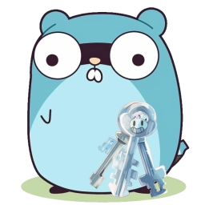

<div align=center>
  <h1>LDAP Selfservice Password Changer</h1>

<span>LDAP Selfservice Password Changer is a web frontend and JSON RPC API for allowing your users to change their own passwords in your LDAP or ActiveDirectory server.</span>

  
</div>

## Running

### Natively

If you want to run this service without a Docker container, you have to build it yourself.

Prerequisites:

- Go 1.20+
- Node.js v16+
- Corepack (`npm i -g corepack`)

You can configure this via a `.env.local` file or via command options (for more information you can run `./ldap-selfservice-password-changer --help`).

<!-- Multiline comment idea taken from https://stackoverflow.com/a/12797512 -->

```bash
corepack enable
pnpm i
pnpm build

./ldap-selfservice-password-changer \
  `# You can also configure these via environment variables,` \
  `# please see the .env file for available options.` \
  -ldap-server ldaps://dc1.example.com:636 -active-directory \
  -readonly-password readonly -readonly-user readonly \
  -base-dn DC=example,DC=com
```

### Docker

We have a Docker image available [here](https://github.com/netresearch/ldap-selfservice-password-changer/pkgs/container/ldap-selfservice-password-changer).

You can ignore the warning that the service could not load a `.env` file.

<!-- Multiline comment idea taken from https://stackoverflow.com/a/12797512 -->

```bash
docker run \
  `# Run the password-changer container detached from the current terminal` \
  -d --name ldap-password-changer \
  `# You might want to mount your host SSL certificate directory,` \
  `# if you have a self-signed certificate for your LDAPS connection` \
  -v /etc/ssl/certs:/etc/ssl/certs:ro \
  -p 3000:3000 \
  ghcr.io/netresearch/ldap-selfservice-password-changer \
  `# You can also configure these via environment variables,` \
  `# please see the .env file for available options.` \
  -ldap-server ldaps://dc1.example.com:636 -active-directory \
  -readonly-password readonly -readonly-user readonly \
  -base-dn DC=example,DC=com
```

## Developing

Prerequisites:

- Go 1.20+
- Node.js v16+
- Corepack (`npm i -g corepack`)

```bash
corepack enable

# Install dependencies
pnpm i

touch .env.local
# Edit the `.env.local` to include the arguments, you want to give to the application.
# Required are:
# - LDAP_SERVER
# - LDAP_BASE_DN
# - LDAP_READONLY_USER
# - LDAP_READONLY_PASSWORD

# Running normally
pnpm start

# Running in dev mode
#   This will restart the application every time, you make
#   a change.
pnpm dev
```

## License

LDAP Selfservice Password Changer is licensed under the MIT license, for more information please refer to the [included LICENSE file](LICENSE).

## Contributing

Feel free to contribute by creating a Pull Request!

This project uses [Conventional Commits](https://www.conventionalcommits.org/en/v1.0.0/) for commit messages and the default `gofmt` and `prettier` formatting rules.
